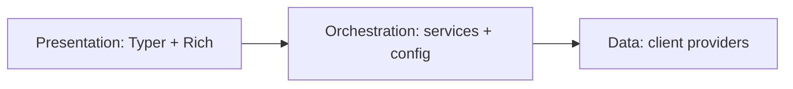
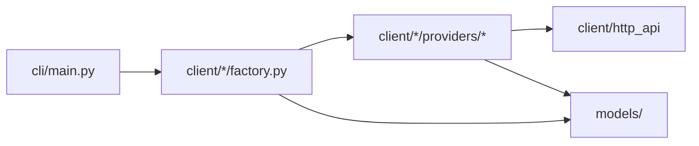

# mydash 🌟

> **Your personal daily dashboard in the terminal.**  
> Weather, news, markets, and eventually calendar and AI-powered briefs — all in one place.

[](https://www.python.org/downloads/)
[](https://github.com/Kultrol/mydash)
[](https://opensource.org/licenses/MIT)
[](https://github.com/Kultrol/mydash)

**mydash** is a command-line dashboard built with Python. It pulls data from public APIs and presents it in the terminal using Rich. The goal is a **production-ready three-layer application** — presentation, orchestration, and data — with clear boundaries invested in early so the CLI can grow without costly rewrites later.

> ⚠️ **Active development:** APIs, commands, configuration, and project layout are all evolving. Expect breaking changes.

---

## 📍 Status

**v0.3.0** — Initial client layer and domain tests are **complete**. Shared domain models live in `models/`. The **services layer is under active development**.

### Where things stand

| Area | State |
|------|--------|
| 🌍 Geocoding + weather | ✅ Initial client complete — Open-Meteo provider, factory, protocol; provider + factory tests |
| 📰 News headlines | ✅ Initial client complete — Noozra provider, factory, protocol; provider + factory tests |
| 📊 Stock quotes & bars | ✅ Initial client complete — Alpaca provider, factory, protocol; requires `.env` keys; provider + factory tests |
| 📦 Shared models | ✅ Domain Pydantic types in `models/` (geocoding, weather, news, stocks) for clients, services, and CLI |
| 🔌 Data layer HTTP | ✅ `HttpApiClient` centralizes HTTP; providers under `client/*/providers/` |
| ⚙️ Services | 🚧 **Active development** — orchestration MVP (domain services, config, brief aggregation) |
| 📋 CLI / `brief` | Typer commands still call client factories directly and print models; not yet wired through services |
| 🎨 Presentation | Renderers/commands packages exist as placeholders; Rich layouts not wired yet |
| 🧪 Tests | ✅ Initial client suite for each domain (providers + factories); CLI smoke path; service tests still to come |

### What we're building toward

A stable terminal app where commands stay thin, business logic lives in a services layer, and the client layer focuses on provider APIs and parsing. Presentation (Rich tables and panels) stays separate from data fetching.

The **data layer (clients + models + tests)** has its first solid cut. Focus now is the **MVP of orchestration** (services + config) and then the **MVP of presentation** (commands + renderers), with deeper refactors once those pieces work end-to-end.
---

## 🏗️ Architecture

Target shape — three layers, one direction of dependency:



| Layer | Responsibility |
|-------|----------------|
| **Presentation** | Commands, flags, terminal layout — no HTTP or provider parsing |
| **Orchestration** | Multi-step flows, user settings, brief aggregation, DTOs |
| **Models** | Shared domain Pydantic types used across services, CLI, and clients |
| **Data** | Factories, protocols, API calls, provider-local schemas (geocoding, weather, news, stocks) |

Each data domain follows a factory + protocol + provider implementation pattern so new sources can be added without rewriting the stack. Domain response shapes live in `models/`, not inside each client package.

### Current shape (today)

Initial clients and tests are in place. The CLI still calls client factories directly while services are being built. `cli/commands/` and `cli/renderers/` remain placeholders until the orchestration MVP is ready to wire up.



| Piece | Location | Notes |
|-------|----------|-------|
| **Shared models** | `models/` | Domain types: weather, news, stocks, geocoding |
| **Shared HTTP** | `client/http_api/` | `HttpApiClient.make_request()` for all providers |
| **Providers** | `client/<domain>/providers/<name>/` | Open-Meteo, Noozra, Alpaca |
| **Factories** | `client/<domain>/factory.py` | One factory per domain |
| **Services** | `services/` | 🚧 Under active development |
| **CLI** | `cli/main.py` | Commands + `load_dotenv()` at bootstrap |

---

## 🛠 Tech stack

| Component | Technology | Role |
|-----------|------------|------|
| CLI | [Typer](https://typer.tiangolo.com/) | Commands and help |
| Terminal UI | [Rich](https://rich.readthedocs.io/) | Tables, panels, color |
| HTTP | [httpx](https://www.python-httpx.org/) | Provider API calls |
| Schemas | [Pydantic](https://docs.pydantic.dev/) | Models, settings, DTOs |
| Secrets | python-dotenv | `.env` for API keys |
| Tooling | [uv](https://docs.astral.sh/uv/) + hatchling | Install, run, package |

Likely additions as the CLI matures: TOML user config, broader test fixtures, coverage reporting, and CI.

---

## 📦 Installation

```bash
git clone https://github.com/Kultrol/mydash.git
cd mydash
```

Optional — stock data requires Alpaca credentials:

```bash
cp .env.example .env
# Add STOCK_ALPACA_API_KEY_ID and STOCK_ALPACA_API_SECRET_KEY
```

```bash
# Install uv: https://docs.astral.sh/uv/getting-started/installation/
uv sync
```

Or with pip: `python -m venv .venv`, activate, then `pip install -e .`.

Open-Meteo (geocoding and weather) needs no API key. Commands and flags may change between releases while the project is in active development.

---

## Usage

Under the **current application regime**, these commands are available:

```bash
uv run python -m mydash.cli.main weather
uv run python -m mydash.cli.main news
uv run python -m mydash.cli.main stocks    # requires .env Alpaca keys
uv run python -m mydash.cli.main brief
uv run python -m mydash.cli.main --help
```

Output is largely raw model dumps for now — richer Rich layouts land with the presentation MVP. City, news category, and stock symbols are still hardcoded. If something fails, check that dependencies are installed (`uv sync`) and that stock keys are set when using `stocks` or `brief`.

---

## 🔭 Looking ahead

Direction of travel is intentional, though priorities and sequencing may shift as the project evolves.

**How work is paced:** ship an **MVP of each core component** before deep refactors of that component. The initial **client / data** MVP is done. Current work is the **service / orchestration** path; next is the **CLI / UI** path end-to-end, then refactoring, hardening, and polishing once those layers exist.

Themes we're steering toward:

- **Orchestration (now)** — domain services, brief aggregation, config-driven inputs instead of hardcodes
- **Presentation (next)** — thin commands and Rich renderers instead of printing models
- **Quality follow-through** — service-layer tests; shared fixtures so sample payloads and helpers live in one place; continued client hygiene
- **Longer horizon** — more dashboard domains (calendar, tasks, AI-assisted briefs, and so on) and eventually other interfaces that reuse the same orchestration

How new domains get added (models → client → service → renderer → brief) will be documented properly once the three-layer CLI is stable. Until then, treat the multi-domain future as vision more than a fixed guide.
---

## 🧪 Development

```bash
uv sync --group dev
uv run pytest
```

Initial client tests cover geocoding, weather, news, and stocks (factories and providers). There is a small CLI smoke path. Service-layer tests will land with the services MVP. Shared fixtures in `test/conftest.py` are still mostly stubs — provider tests currently own their own sample data.

Contributions, ideas, and feedback are welcome. This is a personal project — I'm learning as I go — focused on clean structure, good terminal UX, and reliable data aggregation.
---

## AI-assisted development

Parts of this codebase were built with [Grok Build](https://x.ai/cli) — in the Cursor editor and on the command line, using models including Grok 4.5 and earlier Cursor-hosted Grok variants. That work includes small fixes, comments, `TODO` markers, and targeted patches. Design and larger features are reviewed manually. AI-assisted changes land on `grok/*` branches before merge and `pytest`.

---

## 📄 License

MIT — see [`LICENSE`](LICENSE).

## 🙏 Acknowledgments

- [Open-Meteo](https://open-meteo.com/) for free weather and geocoding APIs
- Typer and Rich maintainers and the Python CLI community
- Inspiration from `wttr.in`, neofetch, and terminal dashboards

---

**Built with ❤️ by [Kevin Medina](https://github.com/Kultrol) · Miami, FL**

*Last updated: July 2026 · v0.3.0 · Services layer in progress*
