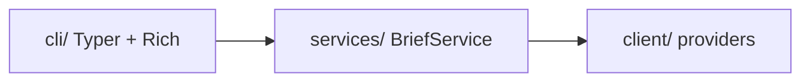

# mydash 🌟

> **Your personal daily dashboard in the terminal.**  
> Weather, news, and markets — one command, three stacked panels.

[](https://www.python.org/downloads/)
[](https://github.com/Kultrol/mydash)
[](https://opensource.org/licenses/MIT)
[](https://github.com/Kultrol/mydash)

**mydash** is a friendly command-line daily brief for Python folks who live in the terminal. It pulls live data from public APIs and paints it with Rich so your morning check-in feels quick and clear. The **v0.5.0 MVP** shows a clean three-layer layout: **CLI → services → clients**.

---

## ✨ Demo (v0.5.0 MVP)

Fire it up:

```bash
mydash brief
```

You’ll get three full-width panels:

| Panel | What you see |
|-------|----------------|
| 📈 **Markets** | Quotes & bars with `$`, ↑/↓ markers, and “As of” times |
| 🌤️ **Weather** | Next six hours for the configured city |
| 📰 **Headlines** | A short list; source names are clickable links in supported terminals |

> ⚠️ **MVP honesty:** city, news category, and stock symbols are still hardcoded. The only command today is `brief` — and that’s intentional for a focused demo.

---

## 📋 Requirements

- 🐍 **Python 3.12+**
- 🌐 Network access
- ☁️ Weather & geocoding: [Open-Meteo](https://open-meteo.com/) (no key)
- 🗞️ News: Noozra (no key)
- 📊 Stocks: [Alpaca](https://alpaca.markets/) API key + secret in `.env`

---

## 📦 Install

```bash
git clone https://github.com/Kultrol/mydash.git
cd mydash
```

Optional — needed for market data:

```bash
cp .env.example .env
# Add STOCK_ALPACA_API_KEY_ID and STOCK_ALPACA_API_SECRET_KEY
```

With [uv](https://docs.astral.sh/uv/) (recommended):

```bash
uv sync
```

Or with plain pip:

```bash
python -m venv .venv
source .venv/bin/activate   # Windows: .venv\Scripts\activate
pip install -e .
```

---

## 🚀 Usage

```bash
mydash brief
mydash --help

# Same thing via the module path
python -m mydash.cli.main brief
```

If markets look empty or fail, double-check your `.env` keys and that deps are installed (`uv sync` or `pip install -e .`).

---

## 🏗️ Architecture

Three layers, one way traffic:



| Layer | Role |
|-------|------|
| 🎨 **Presentation** | `cli/` — commands and Rich panels |
| ⚙️ **Orchestration** | `services/` — `BriefService` + `DailyBrief` |
| 🔌 **Data** | `client/` — factories, protocols, HTTP providers |
| 📦 **Models** | `models/` — shared Pydantic domain types |

Want the deeper map? See [docs/ARCHITECTURE.md](docs/ARCHITECTURE.md).

---

## 🛠️ Tech stack

| Component | Technology |
|-----------|------------|
| ⌨️ CLI | [Typer](https://typer.tiangolo.com/) |
| 🌈 Terminal UI | [Rich](https://rich.readthedocs.io/) |
| 🌍 HTTP | [httpx](https://www.python-httpx.org/) |
| 📐 Schemas | [Pydantic](https://docs.pydantic.dev/) |
| 🔐 Secrets | python-dotenv |
| 🧰 Tooling | [uv](https://docs.astral.sh/uv/) + hatchling |

---

## 🧪 Development

```bash
uv sync --group dev
uv run pytest
```

Tests cover clients (providers + factories), brief service orchestration, and a CLI smoke path for `brief`.

---

## 🔭 Looking ahead

**Today (v0.5.0)** is a working MVP demo: one `brief` command, three panels, and a clean three-layer layout you can install and run.

**Version 1.0** means a production-ready *terminal* app you can rely on day to day — still not a website. Web and other interfaces can reuse the same service layer later.

### Path to 1.0

- 🧭 **Config & personalization** — choose your city, news category, and stock symbols via a settings file and/or command-line flags instead of hardcodes in the service layer  
- ⌨️ **CLI polish** — clearer help and error messages; flags to override defaults for a single run; optional focused commands (weather / news / stocks) that go through the service layer, not raw client calls  
- 🔌 **Solid data layer** — fix remaining edge cases in clients (for example forecast day grouping and how cached results are replaced on a new fetch), consistent request timeouts so calls don’t hang forever, and cleaner shared HTTP plumbing where it still duplicates  
- 🧪 **Tests & automation** — refactor the suite with shared fixtures and less duplicated setup, then add automated checks on every push and enough coverage that refactors stay safe  
- 📚 **Docs for a stable release** — changelog, install notes that match real behavior, and a command surface that feels intentional for daily use  

### After 1.0

- 🌐 A website or small API on top of the same services (no second copy of the business logic)  
- ⚡ Optional caching for faster repeat views  
- 📅 More dashboard domains over time (calendar, tasks, AI-assisted briefs, and similar)

Layer boundaries today are documented in [docs/ARCHITECTURE.md](docs/ARCHITECTURE.md).

---

## 🤖 AI-assisted development

Parts of this codebase were built with help from [Grok Build](https://x.ai/cli) (Cursor and the CLI) and related tooling. Typical uses included:

- 🩹 **Small fixes** — bug fixes, comment cleanups, and other limited changes I could check file by file  
- 🧪 **Quick experiments** — trying CLI layout ideas and how the service layer wires to clients before locking in an approach  
- 🧹 **Tedious refactors** — mechanical work such as moving domain schemas into a shared `models/` package and updating imports across clients and tests  
- 📝 **Boilerplate & docs** — starting test files, improving docstrings, and polishing README/architecture notes  

Design decisions and larger features are still reviewed and owned manually. AI-assisted work is meant to speed up the boring parts, not replace judgment on architecture or product direction.

---

## 📄 License

MIT — see [`LICENSE`](LICENSE).

## 🙏 Acknowledgments

- ☁️ [Open-Meteo](https://open-meteo.com/) for weather and geocoding  
- 🐍 Typer, Rich, and the Python CLI community  
- 💡 Inspiration from `wttr.in`, neofetch, and other terminal dashboards  

---

**Built with ❤️ by [Kevin Medina](https://github.com/Kultrol) · Miami, FL**

*v0.5.0 · MVP · happy briefing ☕*
