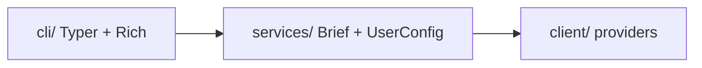

# mydash 🌟

> **Your personal daily dashboard in the terminal.**  
> Weather, news, and markets — one command, three stacked panels.

[](https://www.python.org/downloads/)
[](https://github.com/Kultrol/mydash/releases/tag/v0.5.0)
[](https://github.com/Kultrol/mydash/releases)
[](https://opensource.org/licenses/MIT)
[](https://github.com/Kultrol/mydash/releases/tag/v0.5.0)

**mydash** is a friendly command-line daily brief for Python folks who live in the terminal. It pulls live data from public APIs and paints it with Rich so your morning check-in feels quick and clear.

> **Still an MVP** — not a polished 1.0 product. You get a daily **`brief`**, user **`set`** preferences, and a clean three-layer layout (**CLI → services → clients**). Defaults ship out of the box; personalize city, symbols, news category, units, and providers with `mydash set`.

---

## ✨ Demo

Fire it up:

```bash
mydash brief
```


*Three stacked panels: markets, weather, and headlines.*


*Short walkthrough of the daily brief in the terminal.*

You’ll get three full-width panels:

| Panel | What you see |
|-------|----------------|
| 📈 **Markets** | Quotes & bars with `$`, ↑/↓ markers, and “As of” times |
| 🌤️ **Weather** | Next six hours for your configured city (metric or imperial) |
| 📰 **Headlines** | A short list; source names are clickable links in supported terminals |

---

## 📋 Requirements

- 🐍 **Python 3.12+**
- 🌐 Network access
- ☁️ Weather & geocoding: [Open-Meteo](https://open-meteo.com/) (**no API key**)
- 🗞️ News: Noozra (**no API key**)
- 📊 Stocks: [Alpaca](https://alpaca.markets/) API key + secret in `.env` (**optional** — only for the markets panel)

---

## 📦 Install

### Option A — install from the GitHub Release (quickest)

Download and install the published **v0.5.0 MVP** wheel (Python 3.12+):

```bash
python -m venv .venv
source .venv/bin/activate   # Windows: .venv\Scripts\activate
pip install https://github.com/Kultrol/mydash/releases/download/v0.5.0/mydash-0.5.0-py3-none-any.whl
mydash brief
```

You can also grab the `.whl` or `.tar.gz` from the [Releases page](https://github.com/Kultrol/mydash/releases) and `pip install` the file locally.

### Option B — install from source

```bash
git clone https://github.com/Kultrol/mydash.git
cd mydash
```

With [uv](https://docs.astral.sh/uv/) (recommended):

```bash
uv sync
```

Or with plain pip:

```bash
python -m venv .venv
source .venv/bin/activate   # Windows: .venv\Scripts\activate
pip install -e .
```

---

## 🔐 Environment setup

Weather and news work **with no configuration**. Markets need Alpaca credentials.

1. Create a free account at [Alpaca](https://alpaca.markets/) and generate API keys (paper-trading keys are fine for market data).
2. Copy the example env file and fill in your keys:

```bash
cp .env.example .env
```

3. Edit `.env`:

```bash
STOCK_ALPACA_API_KEY_ID=your_alpaca_key_id
STOCK_ALPACA_API_SECRET_KEY=your_alpaca_secret
```

| Variable | Required? | Used for |
|----------|-----------|----------|
| `STOCK_ALPACA_API_KEY_ID` | For markets panel | Alpaca API key ID |
| `STOCK_ALPACA_API_SECRET_KEY` | For markets panel | Alpaca API secret |

- Place `.env` in the directory from which you run `mydash` (the CLI loads it via `python-dotenv` at startup).
- **Never commit `.env`** — it is gitignored. Only `.env.example` (placeholders) is tracked.

If you skip Alpaca keys, you can still run `mydash brief`; weather and headlines should appear, while markets may fail or look empty.

---

## 🚀 Usage

```bash
mydash brief
mydash --help

# Preferences (persisted as JSON via platformdirs)
mydash set                 # hint: use --help or -lo
mydash set -lo             # list all set subcommands
mydash set weather units imperial
mydash set weather city "Austin"
mydash set stocks add GOOG
mydash set news category politics
mydash set show            # dump current config

# Same thing via the module path
python -m mydash.cli.main brief
```

### User config file

Preferences live in a platform-appropriate user config directory (via [platformdirs](https://platformdirs.readthedocs.io/)):

| Platform | Typical path |
|----------|----------------|
| macOS | `~/Library/Application Support/mydash/config.json` |
| Linux | `~/.config/mydash/config.json` (respects `XDG_CONFIG_HOME`) |
| Windows | `%APPDATA%\mydash\config.json` |

The file is created automatically with defaults (Miami, tech news, SPY/AAPL/MSFT, metric units) on first use.

---

## 🔧 Troubleshooting

| Problem | What to try |
|---------|-------------|
| `mydash: command not found` | Activate your venv, or reinstall (`pip install …` / `uv sync`) so the `mydash` entry point is on `PATH` |
| Markets panel empty or errors | Confirm `.env` has both Alpaca vars, keys are valid, and you started the app from a directory that can see that `.env` |
| Wrong city / symbols / units | Run `mydash set show`, then `mydash set weather city …`, `mydash set stocks add …`, or `mydash set weather units …` |
| Config JSON errors | Delete or fix the config file path above; mydash recreates defaults if the file is missing |
| Wrong Python version | Use **3.12+** (`python --version`) |
| Network / API errors | Check connectivity; Open-Meteo and Noozra need outbound HTTPS |

---

## 🏗️ Architecture

Three layers, one way traffic:



| Layer | Role |
|-------|------|
| 🎨 **Presentation** | `cli/` — `brief`, `set`, Rich panels |
| ⚙️ **Orchestration** | `services/` — `BriefService`, domain services, `UserConfigurationService` |
| 🔌 **Data** | `client/` — factories, protocols, HTTP providers |
| 📦 **Models** | `models/` — shared Pydantic domain types |

Want the deeper map? See [docs/ARCHITECTURE.md](docs/ARCHITECTURE.md).

---

## 🛠️ Tech stack

| Component | Technology |
|-----------|------------|
| ⌨️ CLI | [Typer](https://typer.tiangolo.com/) |
| 🌈 Terminal UI | [Rich](https://rich.readthedocs.io/) |
| 🌍 HTTP | [httpx](https://www.python-httpx.org/) |
| 📐 Schemas | [Pydantic](https://docs.pydantic.dev/) |
| 📁 Config path | [platformdirs](https://platformdirs.readthedocs.io/) |
| 🔐 Secrets | python-dotenv |
| 🧰 Tooling | [uv](https://docs.astral.sh/uv/) + hatchling |

---

## 🧪 Development

```bash
uv sync --group dev
uv run pytest
```

Tests cover clients (providers + factories), services (brief + user config), and CLI paths for `brief` and `set`.

---

## 🔭 Looking ahead

**mydash is a terminal app.** There is no web UI, no API server, and none is planned — every improvement goes into making the CLI faster, clearer, and nicer to live in.

### Path to 1.0

- ⌨️ **CLI polish** — focused commands (weather / news / stocks), per-run overrides, and a consistent visual language across every panel  
- 🔌 **Solid data layer** — resilient clients, consistent timeouts and retries, cached responses for instant repeat views  
- 🧪 **Tests & automation** — shared fixtures, CI on every push, enough coverage that refactors stay safe  
- 📚 **Docs for a stable release** — keep [CHANGELOG](CHANGELOG.md) current and a command surface that feels intentional for daily use  

### After 1.0

- 📅 More dashboard domains over time (calendar, tasks, AI-assisted briefs, and similar)  
- 🎨 Themes and per-panel layout preferences  
- 📦 Distribution polish (Homebrew, pipx-first install docs)

Layer boundaries today are documented in [docs/ARCHITECTURE.md](docs/ARCHITECTURE.md).

---

## 🤖 AI-assisted development

Parts of this codebase were built with help from [Grok Build](https://x.ai/cli) (Cursor and the CLI) and related tooling. Typical uses included:

- 🩹 **Small fixes** — bug fixes, comment cleanups, and other limited changes I could check file by file  
- 🧪 **Quick experiments** — trying CLI layout ideas and how the service layer wires to clients before locking in an approach  
- 🧹 **Tedious refactors** — mechanical work such as moving domain schemas into a shared `models/` package and updating imports across clients and tests  
- 📝 **Boilerplate & docs** — starting test files, improving docstrings, and polishing README/architecture notes  

Design decisions and larger features are still reviewed and owned manually. AI-assisted work is meant to speed up the boring parts, not replace judgment on architecture or product direction.

---

## 📄 License

MIT — see [`LICENSE`](LICENSE).

## 🙏 Acknowledgments

- ☁️ [Open-Meteo](https://open-meteo.com/) for weather and geocoding  
- 🐍 Typer, Rich, and the Python CLI community  
- 💡 Inspiration from `wttr.in`, neofetch, and other terminal dashboards  

---

**Built with ❤️ by [Kevin Medina](https://github.com/Kultrol) · Miami, FL**

*v0.5.0 · MVP · happy briefing ☕*
