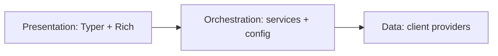

# mydash 🌟

> **Your personal daily dashboard in the terminal.**  
> Weather, news, markets, and eventually calendar and AI-powered briefs — all in one place.

[](https://www.python.org/downloads/)
[](https://opensource.org/licenses/MIT)
[](https://github.com/Kultrol/mydash)

**mydash** is a command-line dashboard built with Python. It pulls data from public APIs and presents it in the terminal using Rich. The goal is a **production-ready three-layer application** — presentation, orchestration, and data — with clear boundaries invested in early so the CLI can grow without costly rewrites later.

> ⚠️ **Active development:** APIs, commands, configuration, and project layout are all evolving. Expect breaking changes.

---

## 📍 Status

### What you can try today (v0.1)

| Area | State |
|------|--------|
| 🌍 Geocoding + weather | Open-Meteo integration; functional with known correctness gaps |
| 📰 News headlines | Noozra integration; category hardcoded in places |
| 📊 Stock quotes & bars | Alpaca integration; requires API keys in `.env` |
| 📋 `brief` command | Chains weather, news, and stocks — no dedicated orchestration layer yet |

### What we're building toward

A stable terminal app where commands stay thin, business logic lives in a services layer, and the client layer focuses on provider APIs and parsing. Presentation (Rich tables and panels) stays separate from data fetching. There is a large backlog of correctness fixes, tests, structure, and polish before that target is met — and that's okay; I'd rather get the foundation right.

---

## 🏗️ Architecture

Target shape — three layers, one direction of dependency:



| Layer | Responsibility |
|-------|----------------|
| **Presentation** | Commands, flags, terminal layout — no HTTP or provider parsing |
| **Orchestration** | Multi-step flows, user settings, brief aggregation, DTOs |
| **Data** | Factories, protocols, API calls, schemas per domain (geocoding, weather, news, stocks) |

Each data domain follows a factory + protocol + provider implementation pattern so new sources can be added without rewriting the stack.

---

## 🛠 Tech stack

| Component | Technology | Role |
|-----------|------------|------|
| CLI | [Typer](https://typer.tiangolo.com/) | Commands and help |
| Terminal UI | [Rich](https://rich.readthedocs.io/) | Tables, panels, color |
| HTTP | [httpx](https://www.python-httpx.org/) | Provider API calls |
| Schemas | [Pydantic](https://docs.pydantic.dev/) | Models, settings, DTOs |
| Secrets | python-dotenv | `.env` for API keys |
| Tooling | [uv](https://docs.astral.sh/uv/) + hatchling | Install, run, package |

**Planned (CLI stage):** TOML user config, pytest-cov, CI pipeline.

---

## 📦 Installation

```bash
git clone https://github.com/Kultrol/mydash.git
cd mydash
```

Optional — stock data requires Alpaca credentials:

```bash
cp .env.example .env
# Add STOCK_ALPACA_API_KEY_ID and STOCK_ALPACA_API_SECRET_KEY
```

```bash
# Install uv: https://docs.astral.sh/uv/getting-started/installation/
uv sync
```

Or with pip: `python -m venv .venv`, activate, then `pip install -e .`.

Open-Meteo (geocoding and weather) needs no API key. Commands and flags may change between releases while the project is in active development.

---

## Usage

Under the **current application regime**, these commands are available:

```bash
uv run python -m mydash.cli.main weather
uv run python -m mydash.cli.main news
uv run python -m mydash.cli.main stocks    # requires .env Alpaca keys
uv run python -m mydash.cli.main brief
uv run python -m mydash.cli.main --help
```

Output is raw model dumps in places — dedicated renderers and config-driven defaults are on the roadmap. If something fails, check that dependencies are installed (`uv sync`) and that stock keys are set when using `stocks` or `brief`.

---

## 🚀 Roadmap

A lot remains before mydash is production-ready. Work is staged roughly in dependency order.

### Phase 1 — Data correctness

- [ ] Fix weather forecast day-boundary grouping
- [ ] Replace-on-fetch cache semantics for news and stocks
- [ ] HTTP timeout parity for Alpaca (match other clients)

### Phase 2 — Test foundation

- [ ] Shared pytest fixtures and sample API payloads
- [ ] Stock tests that do not depend on a local `.env`
- [ ] Weather forecast parser coverage (including month boundaries)
- [ ] News and Alpaca success-path and field-mapping tests
- [ ] Cache contamination regression tests
- [ ] Centralized HTTP error test helpers

### Phase 3 — Three-layer CLI

- [ ] Services layer for weather, news, and stocks
- [ ] Brief orchestration service with partial-failure handling
- [ ] Central configuration (city, categories, watchlist, secrets bootstrap)
- [ ] Split commands and domain Rich renderers
- [ ] `daily-brief` as the primary aggregated command (`brief` alias during transition)
- [ ] Config-driven inputs instead of hardcoded city and category

### Phase 4 — Client hardening and quality

- [ ] Shared HTTP layer across domain clients
- [ ] Consistent factory behavior and injectable settings
- [ ] Weather parser extracted for isolated testing
- [ ] Configurable stock watchlist
- [ ] Secrets loaded at app entry, not inside client constructors
- [ ] Domain exception hierarchy and structured logging in clients
- [ ] Provider response validation models
- [ ] Test import consistency and duplicate test cleanup
- [ ] Coverage reporting and CI

### Packaging and scaffolding (under review)

- [ ] Packaging workflow (`uv sync`, hatchling src layout) — to be revisited
- [ ] Client scaffolding (geocoding, weather, news, stocks) — active development

### Later — expanded CLI

- [ ] Calendar and tasks integration
- [ ] AI-generated brief insights
- [ ] Reverse geocoding and automatic location
- [ ] Theming and richer terminal layouts

Track epics and tasks on the [GitHub Roadmap](https://github.com/Kultrol/mydash/issues?q=is%3Aopen+label%3Atype%3Aepic).

---

## 🧪 Development

```bash
uv sync --group dev
uv run pytest
```

Contributions, ideas, and feedback are welcome. This is a personal project — I'm learning as I go — focused on clean structure, good terminal UX, and reliable data aggregation.

### Where this is headed

Today mydash centers on weather, news, and markets — but the architecture is meant to support more. Over time I'd like to plug in calendar and tasks, commute or travel context, health or fitness summaries, local events, and AI-generated "what matters today" briefs, all feeding the same daily dashboard.

How new domains get added (client → service → renderer → brief) will be documented properly once the three-layer CLI is stable. Until then, treat this as the vision, not a step-by-step guide.

---

## AI-assisted development

Parts of this codebase were built with [Grok Build](https://x.ai/cli) — in the Cursor editor and via the Cursor model on the command line. That work includes small fixes, comments, `TODO` markers, and targeted patches. Design and larger features are reviewed manually. AI-assisted changes land on `grok/*` branches before merge and `pytest`.

---

## 📄 License

MIT — see [`LICENSE`](LICENSE).

## 🙏 Acknowledgments

- [Open-Meteo](https://open-meteo.com/) for free weather and geocoding APIs
- Typer and Rich maintainers and the Python CLI community
- Inspiration from `wttr.in`, neofetch, and terminal dashboards

---

**Built with ❤️ by [Kevin Medina](https://github.com/Kultrol) · Miami, FL**

*Last updated: July 2026 · Actively iterating*
