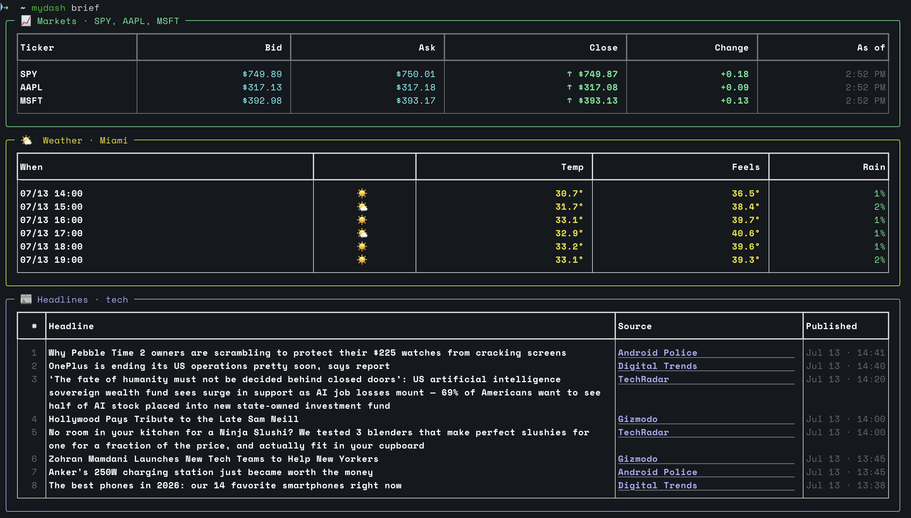
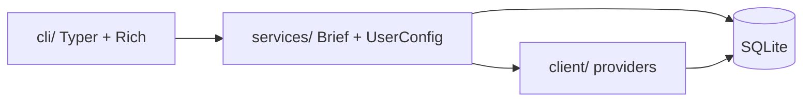

# mydash 🌟

> **Your personal daily dashboard in the terminal.**  
> Weather, news, and markets — one command, three stacked panels.

[](https://www.python.org/downloads/)
[](https://github.com/Kultrol/mydash/releases)
[](https://github.com/Kultrol/mydash/releases)
[](https://opensource.org/licenses/MIT)
[](https://github.com/Kultrol/mydash/releases)

**mydash** is a friendly command-line daily brief for Python folks who live in the terminal. It pulls live data from public APIs and paints it with Rich so your morning check-in feels quick and clear.

> **Pre-1.0, but daily-usable.** A full `brief` plus focused `weather` / `news` / `stocks` commands, a setup wizard, cached responses, and per-panel failure handling — one provider being down never costs you the rest of the dashboard. Defaults ship out of the box; personalize everything with `mydash init` or `mydash set`.

---

## ✨ Demo

Fire it up:

```bash
mydash brief
```



*Three stacked panels: markets, weather, and headlines.*


*Short walkthrough of the daily brief in the terminal.*

You’ll get three full-width panels:

| Panel | What you see |
|-------|----------------|
| 📈 **Markets** | Quotes & bars with `$`, ↑/↓ markers, and “As of” times |
| 🌤️ **Weather** | Next six hours for your configured city (metric or imperial) |
| 📰 **Headlines** | A short list; source names are clickable links in supported terminals |

---

## 📋 Requirements

- 🐍 **Python 3.12+**
- 🌐 Network access
- ☁️ Weather & geocoding: [Open-Meteo](https://open-meteo.com/) (**no API key**)
- 🗞️ News: Noozra (**no API key**)
- 📊 Stocks: [Alpaca](https://alpaca.markets/) API key + secret in `.env` (**optional** — only for the markets panel)

---

## 📦 Install

### Option A — install from the GitHub Release (quickest)

Grab the `.whl` from the [Releases page](https://github.com/Kultrol/mydash/releases) (Python 3.12+) and install it:

```bash
python -m venv .venv
source .venv/bin/activate   # Windows: .venv\Scripts\activate
pip install ./mydash-<version>-py3-none-any.whl
mydash init
```

The published release is currently **v0.5.0**; 0.6.0 is on `main` and not yet cut as a release, so use Option B for it.

### Option B — install from source

```bash
git clone https://github.com/Kultrol/mydash.git
cd mydash
```

With [uv](https://docs.astral.sh/uv/) (recommended):

```bash
uv sync
```

Or with plain pip:

```bash
python -m venv .venv
source .venv/bin/activate   # Windows: .venv\Scripts\activate
pip install -e .
```

---

## 🔐 Environment setup

Weather and news work **with no configuration**. Markets need Alpaca credentials.

1. Create a free account at [Alpaca](https://alpaca.markets/) and generate API keys (paper-trading keys are fine for market data).
2. Copy the example env file and fill in your keys:

```bash
cp .env.example .env
```

3. Edit `.env`:

```bash
STOCK_ALPACA_API_KEY_ID=your_alpaca_key_id
STOCK_ALPACA_API_SECRET_KEY=your_alpaca_secret
```

| Variable | Required? | Used for |
|----------|-----------|----------|
| `STOCK_ALPACA_API_KEY_ID` | For markets panel | Alpaca API key ID |
| `STOCK_ALPACA_API_SECRET_KEY` | For markets panel | Alpaca API secret |

- Place `.env` in the directory from which you run `mydash` (the CLI loads it via `python-dotenv` at startup).
- **Never commit `.env`** — it is gitignored. Only `.env.example` (placeholders) is tracked.

If you skip Alpaca keys, `mydash brief` still works: weather and headlines render normally and the markets panel says what it needs. Run `mydash doctor` to check what mydash can and cannot reach.

---

## 🚀 Usage

```bash
mydash                     # what's configured, and what you can run
mydash init                # setup wizard: city, units, category, tickers
mydash brief               # the full dashboard
```

### Commands

| Command | Does |
|---------|------|
| `mydash brief` | Markets, weather, and headlines in one view |
| `mydash weather` | Just the forecast |
| `mydash news` | Just the headlines |
| `mydash stocks` | Just your watch list |
| `mydash init` | Setup wizard |
| `mydash doctor` | Check storage, credentials, and provider reachability |
| `mydash set …` | Change a saved preference |
| `mydash config show \| path \| reset` | Inspect, locate, or reset preferences |
| `mydash cache info \| clear` | Inspect or drop cached responses |

### Flags worth knowing

```bash
mydash brief --refresh            # ignore the cache, fetch live
mydash brief --only weather,news  # skip the panels you don't want
mydash brief --compact            # denser tables
mydash brief --json               # machine-readable output
mydash weather --city Tokyo       # one-off override, doesn't change your config
mydash news --limit 15
mydash stocks -s NVDA,AMD
mydash --version
mydash --debug brief              # full traceback instead of an error panel
```

### Preferences

```bash
mydash set -lo                    # list every set subcommand
mydash set weather city "Austin"  # geocodes and shows what it matched
mydash set weather units imperial
mydash set stocks add GOOG
mydash set stocks list
mydash set news category politics
```

### Where your settings live

Preferences and cached responses share one SQLite database, created on first run:

| Platform | Typical path |
|----------|----------------|
| macOS | `~/Library/Application Support/mydash/mydash.db` |
| Linux | `~/.local/share/mydash/mydash.db` (respects `XDG_DATA_HOME`) |
| Windows | `%LOCALAPPDATA%\mydash\mydash.db` |

Run `mydash config path` to print it. Set `MYDASH_DB_PATH` to point at a throwaway database — handy for experimenting without touching your real setup.

Defaults (Miami, tech news, SPY/AAPL/MSFT, metric) are seeded on first use. If you used an older version, its `config.json` is imported automatically and renamed to `config.json.migrated`.

### Caching

Responses are cached so a repeat brief is roughly **4× faster** and lighter on the providers. Freshness windows: geocoding 30 days, weather 15 minutes, news 10 minutes, quotes 60 seconds. Use `--refresh` to bypass, or `mydash cache clear` to empty it.

---

## 🔧 Troubleshooting

| Problem | What to try |
|---------|-------------|
| Anything at all | Run `mydash doctor` first — it checks storage, credentials, and every provider |
| `mydash: command not found` | Activate your venv, or reinstall (`pip install …` / `uv sync`) so the `mydash` entry point is on `PATH` |
| Markets panel says credentials are missing | Confirm `.env` has both Alpaca vars and that you started mydash from a directory that can see it |
| Wrong city / symbols / units | `mydash config show`, then `mydash set weather city …`, `mydash set stocks add …`, or `mydash set weather units …` |
| Got the wrong "Springfield" | `mydash set weather city` prints the full match (region + country); `mydash init` lets you pick between them |
| Stale data | `mydash brief --refresh`, or `mydash cache clear` |
| Corrupt preferences | `mydash config reset`, or delete the database at `mydash config path` |
| Wrong Python version | Use **3.12+** (`python --version`) |
| Network / API errors | Check connectivity; Open-Meteo and Noozra need outbound HTTPS |

---

## 🏗️ Architecture

Three layers, one way traffic:



| Layer | Role |
|-------|------|
| 🎨 **Presentation** | `cli/` — commands, theme, panels |
| ⚙️ **Orchestration** | `services/` — `BriefService`, domain services, `UserConfigurationService` |
| 🔌 **Data** | `client/` — factories, protocols, HTTP providers |
| 📦 **Models** | `models/` — shared Pydantic domain types |
| 💾 **Storage** | `storage/` — SQLite schema and response cache |

One provider being down costs you that panel and nothing else: domains are fetched concurrently and failures come back per panel.

Want the deeper map? See [docs/ARCHITECTURE.md](docs/ARCHITECTURE.md).

---

## 🛠️ Tech stack

| Component | Technology |
|-----------|------------|
| ⌨️ CLI | [Typer](https://typer.tiangolo.com/) |
| 🌈 Terminal UI | [Rich](https://rich.readthedocs.io/) |
| 🌍 HTTP | [httpx](https://www.python-httpx.org/) |
| 📐 Schemas | [Pydantic](https://docs.pydantic.dev/) |
| 💾 Storage | SQLite (stdlib) + [platformdirs](https://platformdirs.readthedocs.io/) |
| 🔐 Secrets | python-dotenv |
| 🧰 Tooling | [uv](https://docs.astral.sh/uv/) + hatchling |

---

## 🧪 Development

```bash
uv sync --group dev
uv run pytest
```

Tests cover clients (providers + factories), services (brief + user config), and CLI paths for `brief` and `set`.

---

## 🔭 Looking ahead

**mydash is a terminal app.** There is no web UI, no API server, and none is planned — every improvement goes into making the CLI faster, clearer, and nicer to live in.

### Path to 1.0

- ⌨️ **CLI polish** — focused commands (weather / news / stocks), per-run overrides, and a consistent visual language across every panel  
- 🔌 **Solid data layer** — resilient clients, consistent timeouts and retries, cached responses for instant repeat views  
- 🧪 **Tests & automation** — shared fixtures, CI on every push, enough coverage that refactors stay safe  
- 📚 **Docs for a stable release** — keep [CHANGELOG](CHANGELOG.md) current and a command surface that feels intentional for daily use  

### After 1.0

- 📅 More dashboard domains over time (calendar, tasks, AI-assisted briefs, and similar)  
- 🎨 Themes and per-panel layout preferences  
- 📦 Distribution polish (Homebrew, pipx-first install docs)

Layer boundaries today are documented in [docs/ARCHITECTURE.md](docs/ARCHITECTURE.md).

---

## 🤖 AI-assisted development

Parts of this codebase were built with help from [Grok Build](https://x.ai/cli) (Cursor and the CLI) and related tooling. Typical uses included:

- 🩹 **Small fixes** — bug fixes, comment cleanups, and other limited changes I could check file by file  
- 🧪 **Quick experiments** — trying CLI layout ideas and how the service layer wires to clients before locking in an approach  
- 🧹 **Tedious refactors** — mechanical work such as moving domain schemas into a shared `models/` package and updating imports across clients and tests  
- 📝 **Boilerplate & docs** — starting test files, improving docstrings, and polishing README/architecture notes  

Design decisions and larger features are still reviewed and owned manually. AI-assisted work is meant to speed up the boring parts, not replace judgment on architecture or product direction.

---

## 📄 License

MIT — see [`LICENSE`](LICENSE).

## 🙏 Acknowledgments

- ☁️ [Open-Meteo](https://open-meteo.com/) for weather and geocoding  
- 🐍 Typer, Rich, and the Python CLI community  
- 💡 Inspiration from `wttr.in`, neofetch, and other terminal dashboards  

---

**Built with ❤️ by [Kevin Medina](https://github.com/Kultrol) · Miami, FL**

*v0.6.0 · happy briefing ☕*
