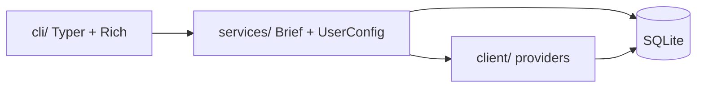

# mydash 🌟

> **Your personal daily dashboard in the terminal.**  
> Weather, news, and markets — one command, from any directory.

[](https://www.python.org/downloads/)
[](https://github.com/Kultrol/mydash/releases)
[](https://github.com/Kultrol/mydash/releases)
[](https://opensource.org/licenses/MIT)
[](https://github.com/Kultrol/mydash/releases)

**mydash** is a command-line daily brief for people who live in the terminal. It pulls live data from public APIs and paints it with Rich, so your morning check-in is one command and a couple of seconds.

Install it once, run `mydash` from wherever you happen to be.

---

## ✨ What it looks like

```
mydash  ·  Monday 31 August  ·  Miami  ·  4:42 PM ──────────────────────────────────────
╭─ 📈 Markets ─────────────────────────────────────────────────────────────────────────╮
│ Ticker           Close       Change           %          Bid          Ask      As of │
│ ──────────────────────────────────────────────────────────────────────────────────── │
│ SPY            $766.87      ▼ -0.39      -0.05%      $767.10      $767.24    4:00 PM │
│ AAPL           $317.14      ▲ +0.21      +0.07%      $303.38      $329.31    4:00 PM │
│ MSFT           $506.95      ▼ -0.40      -0.08%      $484.75      $535.87    4:00 PM │
╰──────────────────────────────────────────────────────────────────── SPY, AAPL, MSFT ─╯
╭─ 🌤️  Weather · Miami ────────────────────────────────────────────────────────────────╮
│ When                            Temp           Feels          Rain              Wind │
│ ──────────────────────────────────────────────────────────────────────────────────── │
│ 16:00            ☁️             30°C            35°C           26%           13 km/h │
│ 17:00            🌤️             30°C            35°C           23%           14 km/h │
│ 18:00            ☀️             30°C            35°C           20%           10 km/h │
│ 19:00            ☁️             29°C            35°C           19%            6 km/h │
│ 20:00            ☁️             28°C            35°C           21%            4 km/h │
│ 21:00            🌧️             26°C            30°C           15%           17 km/h │
╰──────────────────────────────────────────────────── ↑32°C ↓26°C  ·  ☀ 07:00 – 19:41 ─╯
╭─ 📰 Headlines · tech ────────────────────────────────────────────────────────────────╮
│  #   Headline                                              Source               When │
│ ──────────────────────────────────────────────────────────────────────────────────── │
│  1   Review: Coyote vs. Acme is an unabashed love letter   Ars Technica      40m ago │
│      to Looney Tunes                                                                 │
│  2   Building An Energy-Harvesting Business Card           Hackaday          42m ago │
│  3   Top tech of the month: the best new gadgets we've     TechRadar         42m ago │
│      tested                                                                          │
╰──────────────────────────────────────────────────────────────────────────── 3 of 12 ─╯
```

| Panel | What you get |
|-------|--------------|
| 📈 **Markets** | Close, absolute and percentage change with ▲▼ markers, the current spread, and quote times |
| 🌤️ **Weather** | The next hours **in the forecast city's own timezone**, plus today's high, low, sunrise, and sunset |
| 📰 **Headlines** | Newest first, deduplicated, with relative ages and source names that are clickable links in supported terminals |

**One provider being down never costs you the rest of the dashboard.** Panels are fetched concurrently and independently — if Alpaca is unreachable, the markets panel says so and weather and headlines render normally.

---

## 📋 Requirements

- 🐍 **Python 3.12+**
- 🌐 Network access
- ☁️ Weather & geocoding: [Open-Meteo](https://open-meteo.com/) — **no API key**
- 🗞️ News: Noozra — **no API key**
- 📊 Markets: [Alpaca](https://alpaca.markets/) API key + secret — **optional**, only for the markets panel

---

## 📦 Install

### Recommended — as a global tool

This is what makes `mydash` work from any directory. Both of these install it into its own isolated environment and put the `mydash` command on your `PATH`:

```bash
uv tool install git+https://github.com/Kultrol/mydash
```

```bash
pipx install git+https://github.com/Kultrol/mydash
```

Then, from anywhere:

```bash
mydash init
mydash brief
```

To upgrade later: `uv tool upgrade mydash` (or `pipx upgrade mydash`).

### From a release artifact

Grab the `.whl` from the [Releases page](https://github.com/Kultrol/mydash/releases) and hand it to the same tools:

```bash
uv tool install ./mydash-<version>-py3-none-any.whl
```

### From source, for development

```bash
git clone https://github.com/Kultrol/mydash.git
cd mydash
uv sync
uv run mydash brief
```

Prefer plain pip? `python -m venv .venv && source .venv/bin/activate && pip install -e .`

### Shell completion

```bash
mydash --install-completion
```

---

## 🚀 Usage

```bash
mydash                     # what's configured, and what you can run
mydash init                # setup wizard: city, units, category, tickers
mydash brief               # the full dashboard
```

### Commands

| Command | Does |
|---------|------|
| `mydash brief` | Markets, weather, and headlines in one view |
| `mydash weather` | Just the forecast |
| `mydash news` | Just the headlines |
| `mydash stocks` | Just your watch list |
| `mydash init` | Setup wizard |
| `mydash doctor` | Check storage, credentials, and provider reachability |
| `mydash set …` | Change a saved preference |
| `mydash config show \| path \| env \| reset` | Inspect, locate, or reset your setup |
| `mydash cache info \| clear` | Inspect or drop cached responses |

### Flags worth knowing

```bash
mydash brief --refresh            # ignore the cache, fetch live
mydash brief --only weather,news  # skip the panels you don't want
mydash brief --compact            # denser tables
mydash brief --json               # machine-readable output
mydash weather --city Tokyo       # one-off override, doesn't change your config
mydash news --limit 15
mydash stocks -s NVDA,AMD
mydash --version
mydash --debug brief              # full traceback instead of an error panel
```

Per-run overrides never touch what you have saved — `mydash weather --city Tokyo` shows Tokyo once and leaves your city alone.

### Preferences

```bash
mydash set -lo                    # list every set subcommand
mydash set weather city "Austin"  # geocodes, and tells you what it matched
mydash set weather units imperial
mydash set stocks add GOOG
mydash set stocks list
mydash set news category politics
mydash config show
```

Ask for an ambiguous place and mydash tells you which one it picked, rather than guessing silently:

```
╭─ 🌤️  Weather · city ─────────────────────────────────────────────────╮
│ City set to Springfield, Missouri, United States                     │
│ Coordinates: 37.21533, -93.29824                                     │
╰──────────────────────────────────────────────────────────────────────╯
```

Run `mydash init` to pick from the full list of matches instead.

---

## 🔐 Credentials

Weather and news need nothing. Markets need free [Alpaca](https://alpaca.markets/) credentials — paper-trading keys work fine for market data.

For a global install, put them where mydash can always find them:

```bash
mydash config env --create   # writes a fillable file, readable only by you
mydash config env            # shows every location it checks, and which it used
```

Fill in the two values, then confirm with `mydash doctor`.

mydash reads credentials from the first source that has them:

| | Source | Good for |
|---|--------|----------|
| 1 | Real environment variables | CI, shell profiles, one-off runs |
| 2 | The file named by `MYDASH_ENV_FILE` | Pointing at a shared or managed secrets file |
| 3 | A `.env` beside (or above) your current directory | Working inside the repo |
| 4 | `.env` in the mydash data directory | **Global installs — works from anywhere** |

| Variable | Used for |
|----------|----------|
| `STOCK_ALPACA_API_KEY_ID` | Alpaca API key ID |
| `STOCK_ALPACA_API_SECRET_KEY` | Alpaca API secret |

Without them, `mydash brief` still works — the markets panel tells you what it needs and the rest of the dashboard renders normally. Never commit a filled-in `.env`; only `.env.example` is tracked.

---

## 💾 Where your data lives

Preferences and cached responses share one SQLite database, created on first run:

| Platform | Path |
|----------|------|
| macOS | `~/Library/Application Support/mydash/mydash.db` |
| Linux | `~/.local/share/mydash/mydash.db` (respects `XDG_DATA_HOME`) |
| Windows | `%LOCALAPPDATA%\mydash\mydash.db` |

`mydash config path` prints it. Set `MYDASH_DB_PATH` to point at a throwaway database — handy for experimenting without touching your real setup. Credentials follow the database, so an isolated database is an isolated environment.

Defaults (Miami, tech news, SPY/AAPL/MSFT, metric) are seeded on first use. Upgrading from an older version? Your `config.json` is imported automatically and renamed to `config.json.migrated`.

### Caching

Responses are cached, so a repeat brief is roughly **4× faster** and lighter on the providers.

| Domain | Fresh for | Why |
|--------|-----------|-----|
| Geocoding | 30 days | Cities do not move |
| Weather | 15 minutes | Hourly forecasts publish well under this |
| News | 10 minutes | |
| Markets | 60 seconds | Quotes go stale fast; this only collapses repeated runs |

`--refresh` bypasses the cache for one run; `mydash cache clear` empties it.

---

## 🔧 Troubleshooting

**Start with `mydash doctor`.** It checks storage, credentials, and every provider, and tells you which of the three is the problem.

| Problem | What to try |
|---------|-------------|
| `mydash: command not found` | Install as a tool (`uv tool install …` / `pipx install …`) so the command lands on your `PATH`; check `~/.local/bin` is in it |
| Markets panel says credentials are missing | `mydash config env` shows where it looked; `mydash config env --create` starts a file in the right place |
| Wrong city / symbols / units | `mydash config show`, then `mydash set weather city …`, `mydash set stocks add …`, or `mydash set weather units …` |
| Got the wrong "Springfield" | `mydash set weather city` prints the full match; `mydash init` lets you pick between them |
| A ticker shows "No data for" | Alpaca has nothing for that symbol — check the spelling, or whether your plan covers it |
| Stale data | `mydash brief --refresh`, or `mydash cache clear` |
| Corrupt preferences | `mydash config reset`, or delete the database at `mydash config path` |
| Wrong Python version | Use **3.12+** (`python --version`) |
| Network / API errors | Check connectivity; Open-Meteo and Noozra need outbound HTTPS |
| Want the real traceback | `mydash --debug <command>` |

---

## 🏗️ Architecture

Three layers, one way traffic:



| Layer | Role |
|-------|------|
| 🎨 **Presentation** | `cli/` — commands, theme, panels |
| ⚙️ **Orchestration** | `services/` — `BriefService`, domain services, `UserConfigurationService` |
| 🔌 **Data** | `client/` — factories, protocols, HTTP providers |
| 📦 **Models** | `models/` — shared Pydantic domain types |
| 💾 **Storage** | `storage/` — SQLite schema and response cache |

Clients are stateless and forgiving: a malformed article, a geocoding result without coordinates, a ticker with no data — each is skipped rather than sinking the whole request. HTTP retries transient failures with backoff and honours `Retry-After`.

Want the deeper map? See [docs/ARCHITECTURE.md](docs/ARCHITECTURE.md).

---

## 🛠️ Tech stack

| Component | Technology |
|-----------|------------|
| ⌨️ CLI | [Typer](https://typer.tiangolo.com/) |
| 🌈 Terminal UI | [Rich](https://rich.readthedocs.io/) |
| 🌍 HTTP | [httpx](https://www.python-httpx.org/) |
| 📐 Schemas | [Pydantic](https://docs.pydantic.dev/) |
| 💾 Storage | SQLite (stdlib) + [platformdirs](https://platformdirs.readthedocs.io/) |
| 🔐 Secrets | python-dotenv |
| 🧰 Tooling | [uv](https://docs.astral.sh/uv/) + hatchling + [ruff](https://docs.astral.sh/ruff/) |

---

## 🧪 Development

```bash
uv sync --group dev
uv run pytest
uv run ruff check src test
```

382 tests cover the HTTP layer against a real httpx transport, provider parsing and partial-result handling, SQLite storage and cache expiry, brief orchestration including per-domain failure, and the command surface and panel output.

Tests are isolated from your real setup: an autouse fixture pins `MYDASH_DB_PATH` to a temp file, and credential discovery follows it, so a test run can never read or rewrite your own configuration.

Build the artifacts with `uv build`.

---

## 🔭 Looking ahead

**mydash is a terminal app.** There is no web UI, no API server, and none is planned — every improvement goes into making the CLI faster, clearer, and nicer to live in.

### Path to 1.0

- 🧪 **Automation** — CI on every push, so refactors stay safe
- 🎨 **Themes** — the palette already lives in one place; make it swappable
- 📦 **Distribution** — a tagged release and a Homebrew formula
- 📚 **Docs for a stable release** — keep the [CHANGELOG](CHANGELOG.md) current and the command surface intentional

### After 1.0

- 📅 More dashboard domains over time (calendar, tasks, AI-assisted briefs, and similar)
- 🔌 More providers behind the existing factories, so you can pick your own sources
- ⚙️ Per-panel layout preferences

---

## 🤖 AI-assisted development

Parts of this codebase were built with AI assistance. Typical uses included:

- 🩹 **Small fixes** — bug fixes, comment cleanups, and other limited changes I could check file by file  
- 🧪 **Quick experiments** — trying CLI layout ideas and how the service layer wires to clients before locking in an approach  
- 🧹 **Tedious refactors** — mechanical work such as moving domain schemas into a shared `models/` package and updating imports across clients and tests  
- 📝 **Boilerplate & docs** — starting test files, improving docstrings, and polishing README/architecture notes  

Design decisions and larger features are still reviewed and owned manually. AI-assisted work is meant to speed up the boring parts, not replace judgment on architecture or product direction.

---

## 📄 License

MIT — see [`LICENSE`](LICENSE).

## 🙏 Acknowledgments

- ☁️ [Open-Meteo](https://open-meteo.com/) for weather and geocoding  
- 🐍 Typer, Rich, and the Python CLI community  
- 💡 Inspiration from `wttr.in`, neofetch, and other terminal dashboards  

---

**Built with ❤️ by [Kevin Medina](https://github.com/Kultrol) · Miami, FL**

*v0.6.0 · happy briefing ☕*
