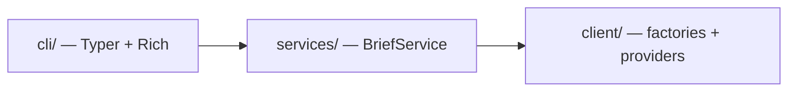

# mydash Architecture

Public reference for the **v0.5.0 MVP** system shape. Product overview and install: [README.md](../README.md).

---

## Strategy

Three layers, one direction of dependency: presentation → orchestration → data. The MVP ships a working terminal **brief** on this stack so later interfaces (config, more commands, web) can attach without rewriting business logic.



---

## Layers (as implemented)

| Layer | Location | Owns | Must not own |
|-------|----------|------|----------------|
| **Presentation** | `cli/` | Commands, terminal layout, user-facing display | HTTP, provider parsing, multi-step fetch order |
| **Orchestration** | `services/` | `BriefService.build()`, `DailyBrief` DTO, default inputs | Rich formatting, raw API JSON |
| **Models** | `models/` | Shared domain Pydantic types | HTTP, Typer, Rich |
| **Data** | `client/` | Factories, protocols, provider HTTP + parsing | Typer, Rich, user preferences |

**Entry path today:** `mydash brief` → `BriefService` → client factories → `render_brief`.

---

## Package layout (MVP)

```
src/mydash/
  cli/
    main.py              # bootstrap: load_dotenv, Typer app
    renderers/
      brief.py           # stacked Markets / Weather / Headlines panels
  services/
    brief.py             # BriefService + DailyBrief
  models/                # weather, news, stocks, geocoding
  client/
    http_api/            # shared HttpApiClient
    geocoding/           # Open-Meteo geocoding
    weather/             # Open-Meteo forecast
    news/                # Noozra
    stocks/              # Alpaca
```

**Deferred (not in v0.5.0):** TOML/`MydashConfig`, domain services per resource, multi-command CLI under `cli/commands/`, caching, FastAPI/web.

---

## Tools

| Tool | Role |
|------|------|
| Python 3.12+ | Runtime |
| uv + hatchling | Install / package (`src` layout) |
| Typer | CLI |
| Rich | Terminal UI |
| httpx | HTTP |
| Pydantic | Models |
| python-dotenv | Alpaca secrets from `.env` |
| pytest + pytest-mock | Tests |

Console script: `mydash` → `mydash.cli.main:app`.

---

## External data providers

| Domain | Provider | Auth |
|--------|----------|------|
| Geocoding | [Open-Meteo Geocoding](https://open-meteo.com/en/docs/geocoding-api) | None |
| Weather | [Open-Meteo Forecast](https://open-meteo.com/en/docs) | None |
| News | Noozra | None (current) |
| Stocks | [Alpaca Market Data](https://alpaca.markets/) | API key + secret via env |

---

## Tests

| Directory | What it tests | Mock target |
|-----------|---------------|-------------|
| `test/client/` | HTTP, parsing, factories | `httpx` / request layer |
| `test/services/` | Brief orchestration / DTO | Client factories |
| `test/cli/` | Command smoke | Services / render path |

---

*v0.5.0 · July 2026*
