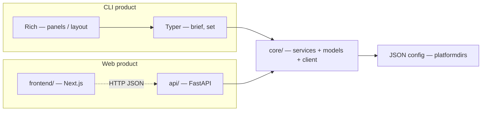

# mydash Architecture

Public reference for the current system shape. Product overview and install: [README.md](../README.md).

---

## Strategy

**Two products, one shared core.** Presentation never owns providers or multi-step fetch order; `core/` never imports Typer, Rich, FastAPI, or React.

| Product | Stack (outer → inner) |
|---------|------------------------|
| **CLI** | Rich → Typer → `core/` |
| **Web** | Next.js → FastAPI → `core/` |



---

## Layers (as implemented)

| Layer | Location | Owns | Must not own |
|-------|----------|------|----------------|
| **CLI display** | `packages/mydash-cli/.../cli/renderers/`, set Rich helpers | Terminal layout, panels, user-facing copy | HTTP, provider parsing, fetch order |
| **CLI commands** | `packages/mydash-cli/.../cli/` | Typer app, subcommands, wiring to core | Provider HTTP, multi-step orchestration |
| **Web server** | `packages/mydash-web/.../api/` | HTTP routes, CORS, status codes | Provider HTTP, business orchestration |
| **Web UI** | `frontend/` | Next.js UI, shadcn, browser fetch to API | Direct calls to Open-Meteo / Noozra / Alpaca |
| **Orchestration** | `packages/mydash-core/.../core/services/` | `BriefService`, domain services, `UserConfigurationService`, DTOs | Rich formatting, FastAPI/Next details, raw API JSON |
| **Models** | `.../core/models/` | Shared domain Pydantic types | HTTP, Typer, Rich, React |
| **Data** | `.../core/client/` | Factories, protocols, provider HTTP + parsing | Typer, Rich, user preferences, Next.js |

**Entry paths:**

- `mydash brief` → Typer → `BriefService` (reads config) → domain services → client factories → Rich `render_brief`
- `mydash set …` → Typer → `UserConfigurationService` → JSON config file (Rich panels for feedback)
- `GET /api/v1/brief` → FastAPI → `BriefService.build()` → JSON for `frontend/`
- *(config HTTP deferred)* `GET /api/v1/config` → `UserConfigurationService` → JSON

**Hosting note:** Deploy **`frontend/`** to [Vercel](https://vercel.com/) (set Root Directory to `frontend`). FastAPI is a separate process and is **not** deployed by that Vercel project; host the API elsewhere when you leave local-only mode. Configure CORS for the Vercel origin when that happens.

---

## Packages (installables)

| Distribution | Import roots | Runtime deps (high level) |
|--------------|--------------|---------------------------|
| **`mydash`** | `mydash.cli` | mydash-core, typer, rich |
| **`mydash-web`** | `mydash.api` | mydash-core, fastapi, uvicorn |
| **`mydash-core`** | `mydash.core` | httpx, pydantic, platformdirs, python-dotenv |

**Namespace package:** `mydash` is a PEP 420 namespace. Each distribution contributes one portion (`core/`, `cli/`, `api/`) with **no** root `mydash/__init__.py`, so the portions merge on `sys.path` (and for Pyright via root `extraPaths`).

Monorepo path:

```
packages/
  mydash-cli/              # PyPI name: mydash
    src/mydash/cli/
      main.py              # bootstrap: load_dotenv, Typer app
      commands/set/        # mydash set (one file per domain)
      renderers/brief.py   # Rich panels
  mydash-web/              # PyPI name: mydash-web
    src/mydash/api/
      main.py
      routers/             # health, brief, config (config wiring deferred)
  mydash-core/             # PyPI name: mydash-core
    src/mydash/core/       # PEP 420 portion (no mydash/__init__.py)
      services/            # BriefService, UserConfigurationService, domain services
      models/
      client/              # factories + providers

frontend/                  # Next.js UI (npm) → HTTP → mydash-web
test/                      # root tests; uv sync installs both products
```

**Still deferred:** caching, live dashboard data on the frontend, single-run CLI overrides for prefs, full config HTTP API.

---

## User configuration

- **Model:** `UserConfig` (city, coordinates, news category, stock symbols, weather units, providers)
- **Service:** `UserConfigurationService` — load/create, mutate, atomic JSON save
- **Path:** `platformdirs.user_config_dir("mydash")` / `config.json`
- **Units:** `metric` | `imperial` → Open-Meteo temperature / wind / precipitation params

---

## Tools

| Tool | Role |
|------|------|
| Python 3.12+ | Runtime |
| uv workspace + hatchling | Monorepo install / three wheels |
| Typer | CLI commands (`mydash`) |
| Rich | CLI terminal UI |
| FastAPI + Uvicorn | HTTP API (`mydash-web`) |
| httpx | HTTP (providers) |
| Pydantic | Models |
| platformdirs | Cross-platform config directory |
| python-dotenv | Alpaca secrets from `.env` |
| pytest + pytest-mock | Tests |
| Next.js + TypeScript | Web UI (`frontend/`) |
| Tailwind CSS + shadcn/ui | Frontend styling / components |
| Vercel | Host `frontend/` only |

Console script (package `mydash`): `mydash` → `mydash.cli.main:app`.  
API (package `mydash-web`): `uvicorn mydash.api.main:app`.

---

## External data providers

| Domain | Provider | Auth |
|--------|----------|------|
| Geocoding | [Open-Meteo Geocoding](https://open-meteo.com/en/docs/geocoding-api) | None |
| Weather | [Open-Meteo Forecast](https://open-meteo.com/en/docs) | None |
| News | Noozra | None (current) |
| Stocks | [Alpaca Market Data](https://alpaca.markets/) | API key + secret via env |

---

## Tests

| Directory | What it tests | Mock target |
|-----------|---------------|-------------|
| `test/core/client/` | HTTP, parsing, factories | `httpx` / request layer |
| `test/core/services/` | Brief + user config | Domain services / geocoding factory / filesystem |
| `test/cli/` | `brief` + `set` command smoke | Services |
| `test/api/` | API routes | Services / dependency overrides |

Pytest uses `--import-mode=importlib` so similarly named provider test modules collect cleanly.

---

*July 2026*
