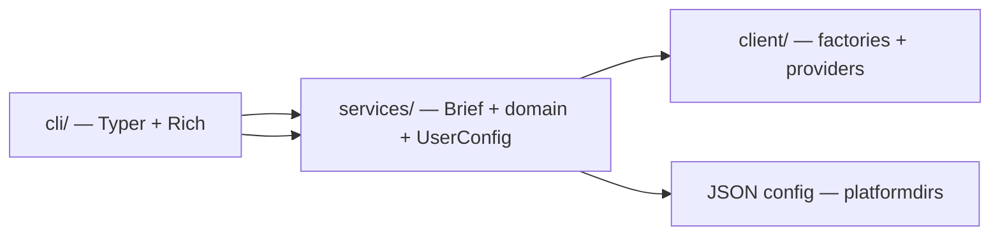

# mydash Architecture

Public reference for the current system shape. Product overview and install: [README.md](../README.md).

---

## Strategy

Three layers, one direction of dependency: presentation → orchestration → data. mydash is a terminal application only — the layering exists so new *commands* and *providers* can be added without rewriting business logic, not to leave room for a web front end.



---

## Layers (as implemented)

| Layer | Location | Owns | Must not own |
|-------|----------|------|----------------|
| **Presentation** | `cli/` | Commands (`brief`, `set`), terminal layout, user-facing display | HTTP, provider parsing, multi-step fetch order |
| **Orchestration** | `services/` | `BriefService`, domain services, `UserConfigurationService`, DTOs | Rich formatting, raw API JSON |
| **Models** | `models/` | Shared domain Pydantic types | HTTP, Typer, Rich |
| **Data** | `client/` | Factories, protocols, provider HTTP + parsing | Typer, Rich, user preferences |

**Entry paths:**

- `mydash brief` → `BriefService` (reads config) → domain services → client factories → `render_brief`
- `mydash set …` → `UserConfigurationService` → JSON config file

---

## Package layout

```
src/mydash/
  cli/
    main.py              # bootstrap: load_dotenv, Typer app
    commands/
      set/               # mydash set (one file per domain — Typer multi-module)
        __init__.py      # set_app assembly + root callback
        _helpers.py      # Rich panels / shared helpers
        weather.py
        stocks.py
        news.py
        geocoding.py
        show.py
    renderers/
      brief.py           # stacked Markets / Weather / Headlines panels
  services/
    brief.py             # BriefService + DailyBrief
    weather.py           # WeatherService
    news.py              # NewsService
    stocks.py            # StocksService
    user_config.py       # UserConfigurationService + UserConfig
  models/                # weather, news, stocks, geocoding
  client/
    http_api/            # shared HttpApiClient
    geocoding/           # Open-Meteo geocoding
    weather/             # Open-Meteo forecast (metric / imperial units)
    news/                # Noozra
    stocks/              # Alpaca
```

**Still deferred:** caching, single-run CLI overrides for prefs.

---

## User configuration

- **Model:** `UserConfig` (city, coordinates, news category, stock symbols, weather units, providers)
- **Service:** `UserConfigurationService` — load/create, mutate, atomic JSON save
- **Path:** `platformdirs.user_config_dir("mydash")` / `config.json`
- **Units:** `metric` | `imperial` → Open-Meteo temperature / wind / precipitation params

---

## Tools

| Tool | Role |
|------|------|
| Python 3.12+ | Runtime |
| uv + hatchling | Install / package (`src` layout) |
| Typer | CLI |
| Rich | Terminal UI |
| httpx | HTTP |
| Pydantic | Models |
| platformdirs | Cross-platform config directory |
| python-dotenv | Alpaca secrets from `.env` |
| pytest + pytest-mock | Tests |

Console script: `mydash` → `mydash.cli.main:app`.

---

## External data providers

| Domain | Provider | Auth |
|--------|----------|------|
| Geocoding | [Open-Meteo Geocoding](https://open-meteo.com/en/docs/geocoding-api) | None |
| Weather | [Open-Meteo Forecast](https://open-meteo.com/en/docs) | None |
| News | Noozra | None (current) |
| Stocks | [Alpaca Market Data](https://alpaca.markets/) | API key + secret via env |

---

## Tests

| Directory | What it tests | Mock target |
|-----------|---------------|-------------|
| `test/client/` | HTTP, parsing, factories | `httpx` / request layer |
| `test/services/` | Brief + user config | Domain services / geocoding factory / filesystem |
| `test/cli/` | `brief` + `set` command smoke | Services |

Pytest uses `--import-mode=importlib` so similarly named provider test modules collect cleanly.

---

*July 2026*
