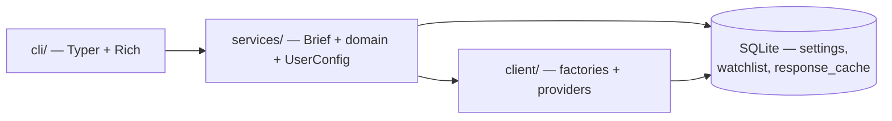

# mydash Architecture

Public reference for the current system shape. Product overview and install: [README.md](../README.md).

---

## Strategy

Three layers, one direction of dependency: presentation → orchestration → data. mydash is a terminal application only — the layering exists so new *commands* and *providers* can be added without rewriting business logic, not to leave room for a web front end.



One SQLite file holds both halves of the persistent state: your preferences, and the short-lived cache of provider responses.

---

## Layers (as implemented)

| Layer | Location | Owns | Must not own |
|-------|----------|------|----------------|
| **Presentation** | `cli/` | Commands, theme, panels, user-facing display | HTTP, provider parsing, multi-step fetch order |
| **Orchestration** | `services/` | `BriefService`, domain services, `UserConfigurationService`, DTOs | Rich formatting, raw API JSON |
| **Models** | `models/` | Shared domain Pydantic types | HTTP, Typer, Rich |
| **Data** | `client/` | Factories, protocols, provider HTTP + parsing | Typer, Rich, user preferences |
| **Storage** | `storage/` | SQLite connection, schema, response cache | Domain meaning, provider specifics |

**Entry paths:**

- `mydash brief` → `BriefService` (reads config) → domain services → client factories → panel renderers
- `mydash weather|news|stocks` → one domain service → the same panel renderer
- `mydash set …` / `config` / `cache` → `UserConfigurationService` / `ResponseCache` → SQLite

---

## Package layout

```
src/mydash/
  cli/
    main.py              # Typer app, welcome panel, error handling
    ui.py                # theme, console, panels, spinner, formatting
    context.py           # where commands reach storage
    commands/
      brief.py           # brief + weather / news / stocks
      init.py            # setup wizard
      doctor.py          # diagnostics
      config.py          # show / path / reset
      cache.py           # info / clear
      set/               # mydash set (one file per domain)
    renderers/
      _common.py         # shared value formatting
      stocks.py          # Markets panel
      weather.py         # Weather panel
      news.py            # Headlines panel
      brief.py           # header + panel stack
  services/
    brief.py             # BriefService + DailyBrief (+ per-domain errors)
    weather.py           # WeatherService
    news.py              # NewsService
    stocks.py            # StocksService
    user_config.py       # UserConfigurationService + UserConfig
  models/                # weather, news, stocks, geocoding
  client/
    http_api/            # shared HttpApiClient (retries, pooling, caching)
    geocoding/           # Open-Meteo geocoding
    weather/             # Open-Meteo forecast (metric / imperial units)
    news/                # Noozra
    stocks/              # Alpaca
  storage/
    database.py          # connection, pragmas, versioned schema
    cache.py             # ResponseCache + per-domain TTLs
```

---

## Storage

One database, created on first run.

| Path | |
|------|--|
| macOS | `~/Library/Application Support/mydash/mydash.db` |
| Linux | `~/.local/share/mydash/mydash.db` |
| Windows | `%LOCALAPPDATA%\mydash\mydash.db` |

Set `MYDASH_DB_PATH` to point at a different file — useful for trying things out without touching your real preferences. The test suite pins it to a temp file for every test.

**Schema (version 1)**

| Table | Holds |
|-------|-------|
| `settings` | One row per scalar preference, JSON-encoded value |
| `watchlist` | Ticker symbols with an explicit `position` for ordering |
| `response_cache` | Cached provider payloads with `stored_at` / `expires_at` |

Migrations are applied on open, tracked with `PRAGMA user_version`. Connections use WAL so a brief can read config while it writes cache rows.

A pre-SQLite `config.json` is imported once on first run and renamed to `config.json.migrated`.

---

## User configuration

- **Model:** `UserConfig` (city, coordinates, news category, stock symbols, weather units, providers)
- **Service:** `UserConfigurationService` — load/seed, mutate one setting per upsert, validate
- **Units:** `metric` | `imperial` → Open-Meteo temperature / wind / precipitation params
- **Coordinates** are stored beside the city, so a brief never re-geocodes

---

## HTTP and caching

`HttpApiClient` wraps httpx with:

- **Retries** — timeouts, connection errors, 429, and 5xx, with exponential backoff and jitter, honouring `Retry-After`
- **Connection reuse** — used as an async context manager, one pool serves every request inside it; `BriefService` opens one per brief
- **Caching** — a `cache_ttl` on a GET reads and writes `response_cache`; `--refresh` skips the read and still refills

Cache keys are a SHA-256 of method + URL + sorted params. Auth headers are excluded deliberately: they are not part of what was asked for, and secrets do not belong in a database column. Every cache operation fails soft — an unwritable database degrades to a miss.

| Domain | TTL | Why |
|--------|-----|-----|
| Geocoding | 30 days | Cities do not move |
| Weather | 15 minutes | Hourly forecasts publish well under this |
| News | 10 minutes | |
| Stocks | 60 seconds | Quotes go stale fast; this only collapses bursts |

---

## Client contracts

Clients are stateless: arguments in, domain models out.

| Domain | Method |
|--------|--------|
| Geocoding | `search(city, *, limit) -> list[Place]` |
| Weather | `fetch_forecast(coordinates, *, days, past_days, units) -> MultiDayForecast` |
| News | `fetch_headlines(category, *, limit) -> NewsHeadlines` |
| Stocks | `fetch_quotes(symbols)` / `fetch_bars(symbols)` |

**Partial results over total failure.** A geocoding result missing coordinates, a malformed article, a ticker Alpaca has no data for: each is skipped, and stock results carry a `missing` list. A client only raises when nothing usable came back at all.

**Weather timestamps are local to the forecast location** (`timezone=auto`), so "the next six hours" means six hours *there*.

---

## Failure handling

`BriefService` gathers domains with `return_exceptions=True` and returns a `DailyBrief` carrying `errors: dict[str, str]`. A provider that is down, rate-limited, or missing credentials costs you its panel and nothing else — the renderer prints the reason where the data would have been.

Uncaught failures reach a `sys.excepthook` that prints a short panel with a next step. `--debug` restores full Rich tracebacks.

---

## Tools

| Tool | Role |
|------|------|
| Python 3.12+ | Runtime |
| uv + hatchling | Install / package (`src` layout) |
| Typer | CLI |
| Rich | Terminal UI |
| httpx | HTTP |
| Pydantic | Models |
| sqlite3 (stdlib) | Storage |
| platformdirs | Cross-platform data directory |
| python-dotenv | Alpaca secrets from `.env` |
| pytest + pytest-mock | Tests |

Console script: `mydash` → `mydash.cli.main:app`.

---

## External data providers

| Domain | Provider | Auth |
|--------|----------|------|
| Geocoding | [Open-Meteo Geocoding](https://open-meteo.com/en/docs/geocoding-api) | None |
| Weather | [Open-Meteo Forecast](https://open-meteo.com/en/docs) | None |
| News | Noozra | None (current) |
| Stocks | [Alpaca Market Data](https://alpaca.markets/) | API key + secret via env |

---

## Tests

| Directory | What it tests | Mock target |
|-----------|---------------|-------------|
| `test/client/http_api/` | Retries, caching, error mapping | `httpx.MockTransport` (real httpx stack) |
| `test/client/` | Parsing, partial results, factories | `FakeHttpClient` from `conftest` |
| `test/storage/` | Schema, transactions, cache TTLs | tmp_path databases |
| `test/models/` | Forecast time logic | — |
| `test/services/` | Brief orchestration, partial failure, user config | Domain services / filesystem |
| `test/cli/` | Command surface and panel output | Services |

Pytest uses `--import-mode=importlib` so similarly named provider test modules collect cleanly. An autouse fixture pins `MYDASH_DB_PATH` to a temp file, so no test can reach the real database.

---

*August 2026*
